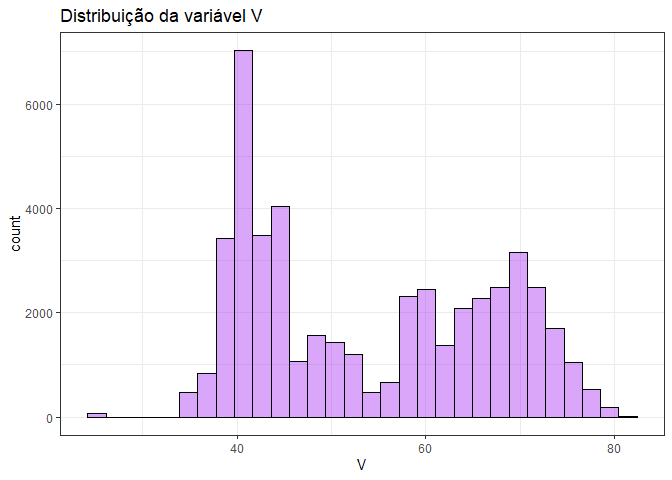
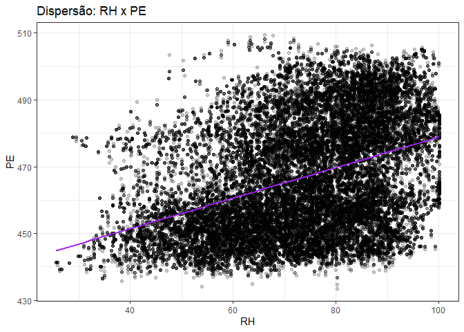

Modelagem Linear: predição de geração de energia em usina de ciclo
combinado.
================

## Introdução

Para esse trabalho final, trago um conjunto de dados, modificado para
essa atividade, sobre geração de energia em uma usina de ciclo combinado
que foi utilizado em uma competição da página
<a href='https://machinehack.com/hackathons/power_plant_energy_output_prediction_weekend_hackathon_13/overview'
target="_blank">Machine Hack</a>.

O conjunto de dados foi coletado de uma Usina de Ciclo Combinado ao
longo de 6 anos (2006-2011) quando a usina foi configurada para
funcionar com carga total. Os recursos consistem em variáveis ambientais
médias horárias Temperatura (T), Pressão Ambiente (AP), Umidade Relativa
(RH) e Vácuo de Exaustão (V) para prever a saída horária líquida de
energia elétrica (PE) da planta.

Uma usina de ciclo combinado (CCPP) é composta por turbinas a gás (GT),
turbinas a vapor (ST) e geradores de vapor de recuperação de calor.

Em um CCPP, a eletricidade é gerada por turbinas a gás e a vapor, que
são combinadas em um ciclo, e são transferidas de uma turbina para
outra. Enquanto o Vácuo é coletado e tem efeito sobre a Turbina a Vapor,
as outras três variáveis ambientais afetam o desempenho do GT.

## Gráficos e tabelas

#### Dados

``` r
dados <- readr::read_rds("data/dados.rds")

dados |> head(5)
```

    ## # A tibble: 5 x 5
    ##      AT     V    AP    RH    PE
    ##   <dbl> <dbl> <dbl> <dbl> <dbl>
    ## 1 17.0   53.2 1014.  82.8  472.
    ## 2  9.6   41.0 1021.  69.0  494.
    ## 3  6.11  38.7 1018.  79.2  496.
    ## 4 12.3   43.2 1009.  78.2  480.
    ## 5 27.7   59.1 1017.  61.2  445.

Importante avaliar como o R interpretou as variáveis do conjunto de
dados. Temos que todas elas são do tipo numérica `<dbl>`, sendo assim
não será necessário modificar nenhuma delas.

``` r
dados |> is.na() |> colSums() 
```

    ## AT  V AP RH PE 
    ##  0  0  0  0  0

Pode-se ver que não há valores `NA` no conjunto de dados.

#### Gráficos

``` r
histograma <- function(var) {
  
  dados |>
    ggplot2::ggplot() +
    ggplot2::aes(x = .data[[var]]) +
    ggplot2::geom_histogram(
      alpha = 0.4,
      color = "black",
      fill = "purple"
    ) +
    ggplot2::labs(
      title = glue::glue("Distribuição da variável {var}")
    ) +
    ggplot2::theme_bw()
  
}

vars <- colnames(dados)

purrr::map(vars, histograma)
```

    ## [[1]]

<!-- -->

    ## 
    ## [[2]]

<!-- -->

    ## 
    ## [[3]]

<!-- -->

    ## 
    ## [[4]]

<!-- -->

    ## 
    ## [[5]]

<!-- -->

Com os histogramas podemos ver que as distribuições das variáveis do
conjunto de dados possuem comportamentos distintos, tendo duas delas com
uma curva bastante semelhante a distribuição normal (AP e RH). Outras
duas com uma distribuição bimodal (AT e PE) e uma delas com uma
distribuição sem um padrão conhecido (V).

``` r
scatter <- function(var) {
  
  dados |>
    ggplot2::ggplot() +
    ggplot2::aes(x = .data[[var]], y = PE) +
    ggplot2::geom_jitter(alpha = 0.2) +
    ggplot2::geom_smooth(color = "purple", method = "lm", se = FALSE) +
    ggplot2::labs(
      title = glue::glue("Dispersão: {var} x PE")
    ) +
    ggplot2::theme_bw()
  
}

vars <- c("AT", "V", "AP", "RH")

purrr::map(vars, scatter)
```

    ## [[1]]

<!-- -->

    ## 
    ## [[2]]

<!-- -->

    ## 
    ## [[3]]

<!-- -->

    ## 
    ## [[4]]

<!-- -->

Os scatterplots acima nos mostram o elacionamento entre as variáveis
preditoras com a variável resposta do nosso problema. As variáveis AT e
V, possuem um comportamento linear bastante forte com a variável
resposta. Já as variáveis AP e RH estão um pouco mais dispersas na área
de plotagem, indicando uma relação mais fraca com a variável resposta.

#### Correlação das variáveis

``` r
correlacao <- cor(dados)
 
correlacao
```

    ##            AT          V          AP          RH         PE
    ## AT  1.0000000  0.8441067 -0.50754934 -0.54253465 -0.9566698
    ## V   0.8441067  1.0000000 -0.41350216 -0.31218728 -0.8766855
    ## AP -0.5075493 -0.4135022  1.00000000  0.09957432  0.5234254
    ## RH -0.5425347 -0.3121873  0.09957432  1.00000000  0.3938820
    ## PE -0.9566698 -0.8766855  0.52342540  0.39388203  1.0000000

Os valores das correlações de Pearson entre as variáveis nos indica que
há uma relação linear forte entre as variáveis AT e V com a variável
resposta, o que foi visto nos scatterplots anteriormente. Já as
variáveis AP e RH possuem uma relação fraca/média com a variável PE.
Todas elas são bastante interessantes para a construção do modelo de
regressão. Porém algumas das variáveis preditoras possuem uma correlação
de Pearson com valor bastante alto (AT e V) entre elas, o que pode
indicar uma colinearidade que atrapalhe os resultados obtidos pelo
modelo, pois pode ser que estejam nos dizendo a mesma coisa sobre os
dados. Para verificar isso de forma mais acertiva, iremos criar um
modelo com todas as variáveis do conjunto de dados e verificar através
da função `vif` (variance inflation factor), quais as que possuem maior
colinearidade com as outras variáveis do modelo.

#### Variance inflation factor (vif)

``` r
modelo_0_0 <- lm(PE ~ ., dados)

performance::check_collinearity(modelo_0_0)
```

    ## # Check for Multicollinearity
    ## 
    ## Low Correlation
    ## 
    ##  Term  VIF   VIF 95% CI Increased SE Tolerance Tolerance 95% CI
    ##    AP 1.45 [1.44, 1.47]         1.21      0.69     [0.68, 0.70]
    ##    RH 1.71 [1.68, 1.73]         1.31      0.59     [0.58, 0.59]
    ##    AT 5.98 [5.88, 6.08]         2.44      0.17     [0.16, 0.17]
    ## 
    ## Moderate Correlation
    ## 
    ##  Term  VIF   VIF 95% CI Increased SE Tolerance Tolerance 95% CI
    ##     V 3.94 [3.88, 4.01]         1.99      0.25     [0.25, 0.26]

``` r
modelo_0_1 <- lm(PE ~ AT + AP + RH, dados)

performance::check_collinearity(modelo_0_1)
```

    ## # Check for Multicollinearity
    ## 
    ## Low Correlation
    ## 
    ##  Term  VIF   VIF 95% CI Increased SE Tolerance Tolerance 95% CI
    ##    AT 2.01 [1.98, 2.04]         1.42      0.50     [0.49, 0.50]
    ##    AP 1.43 [1.42, 1.45]         1.20      0.70     [0.69, 0.71]
    ##    RH 1.51 [1.49, 1.52]         1.23      0.66     [0.66, 0.67]

``` r
modelo_0_2 <- lm(PE ~ V + AP + RH, dados)

performance::check_collinearity(modelo_0_2)
```

    ## # Check for Multicollinearity
    ## 
    ## Low Correlation
    ## 
    ##  Term  VIF   VIF 95% CI Increased SE Tolerance Tolerance 95% CI
    ##     V 1.32 [1.31, 1.34]         1.15      0.75     [0.75, 0.76]
    ##    AP 1.21 [1.20, 1.22]         1.10      0.83     [0.82, 0.84]
    ##    RH 1.11 [1.10, 1.12]         1.05      0.90     [0.89, 0.91]

Com isso, podemos ver que os valores conseguidos através da função
`vif`, para AT e V, são mais altos do que as duas outras variáveis e que
também o valor da correlação de Pearson dessas duas variáveis é bastante
significativo. Assim podemos considerar que há colinearidade entre essas
variáveis e portanto não faz sentido manter as duas na construção do
modelo de regressão, porém posteriormente analisaremos as métricas
necessárias para decidir se o modelo é melhor ou pior com ou sem as duas
variáveis (AT e V).

Quando fazemos um teste e retiramos a variável V ou a variável AT do
modelo, temos que nenhuma das variáveis possue um valor `vif` maior que
cinco. Sendo um bom indício de que as variáveis com maior colinearidade
são mesmo as variáveis AT e V.

## Modelagem

O modelo criado para verificar a colinearidade das variáveis, foi criado
com todas as variáveis do conjunto de dados. Sendo o a partir dele que
conduziremos a análise do modelo de regressão. Também é importante dizer
que a partir desse momento iremos dividir o conjunto de dados em dois,
uma para treinar o modelo e outro para testar posteriormete,
apresentando uma parte do conjunto de dados como se fossem dados novos,
para assim termos uma real dimensão do quão bom será o modelo.

``` r
tamanho_amostra <- floor(0.8 * nrow(dados))

set.seed(100)

treino_index <- sample(nrow(dados), size = tamanho_amostra)

dados_treino <- dados[treino_index,]

dados_teste <- dados[-treino_index,]
```

``` r
modelo_linear <- parsnip::linear_reg() |>
  parsnip::set_engine("lm") |>
  parsnip::set_mode("regression")

metricas <- yardstick::metric_set(
  yardstick::rmse,
  yardstick::rsq,
  yardstick::mae
)
```

#### Avaliando multicolinearidade e a significância dos coeficientes do modelo

``` r
modelo_1 <- modelo_linear |>
  parsnip::fit(PE ~ ., dados_treino) |>
  parsnip::extract_fit_engine()

summary(modelo_1)
```

    ## 
    ## Call:
    ## stats::lm(formula = PE ~ ., data = data)
    ## 
    ## Residuals:
    ##     Min      1Q  Median      3Q     Max 
    ## -37.634  -2.758  -0.203   2.630  18.246 
    ## 
    ## Coefficients:
    ##               Estimate Std. Error t value Pr(>|t|)    
    ## (Intercept) 465.825872   4.265579  109.21   <2e-16 ***
    ## AT           -1.984849   0.006684 -296.95   <2e-16 ***
    ## V            -0.230203   0.003182  -72.35   <2e-16 ***
    ## AP            0.063062   0.004138   15.24   <2e-16 ***
    ## RH           -0.157906   0.001825  -86.54   <2e-16 ***
    ## ---
    ## Signif. codes:  0 '***' 0.001 '**' 0.01 '*' 0.05 '.' 0.1 ' ' 1
    ## 
    ## Residual standard error: 3.985 on 38267 degrees of freedom
    ## Multiple R-squared:  0.9447, Adjusted R-squared:  0.9447 
    ## F-statistic: 1.634e+05 on 4 and 38267 DF,  p-value: < 2.2e-16

Um ponto importante na construção desse modelo com todas as variáveis
preditoras é que ele possui um valor bem alto na métrica do R-quadrado,
como podemos ver acima. Sabemos que quanto mais variáveis o modelo tem,
maior será a métrica R-quadrado, assim vale a pena avaliar se modelos
mais simples, com menos variáveis, manterão a acurácia, errando
aproximadamente a mesma coisa. Dessa forma ao construir modelos sem uma
das varáveis que são colineares, devemos observar se teremos uma perda
significativa na métrica do R-quadrado, ou em qualquer outra que esteja
utilizando para o problema.

Vale ressaltar que o modelo criado incialmente nos indica que as
variáveis são significativas para predizer a variável resposta do
problema. Isso pode ser observado pelo valor-p extremamente baixo, o que
nos mostra uma baixíssima probabilidade de os coeficiente das variáveis
serem iguais a zero, o que anularia a utilização do coeficiente.

``` r
modelo_2 <- modelo_linear |>
  parsnip::fit(PE ~ AT + AP + RH, dados_treino) |>
  parsnip::extract_fit_engine()

summary(modelo_2)
```

    ## 
    ## Call:
    ## stats::lm(formula = PE ~ AT + AP + RH, data = data)
    ## 
    ## Residuals:
    ##     Min      1Q  Median      3Q     Max 
    ## -39.031  -2.913  -0.064   2.755  19.378 
    ## 
    ## Coefficients:
    ##               Estimate Std. Error t value Pr(>|t|)    
    ## (Intercept) 501.479699   4.517482  111.01  < 2e-16 ***
    ## AT           -2.378925   0.004131 -575.86  < 2e-16 ***
    ## AP            0.026449   0.004379    6.04 1.55e-09 ***
    ## RH           -0.203088   0.001828 -111.10  < 2e-16 ***
    ## ---
    ## Signif. codes:  0 '***' 0.001 '**' 0.01 '*' 0.05 '.' 0.1 ' ' 1
    ## 
    ## Residual standard error: 4.249 on 38268 degrees of freedom
    ## Multiple R-squared:  0.9371, Adjusted R-squared:  0.9371 
    ## F-statistic: 1.901e+05 on 3 and 38268 DF,  p-value: < 2.2e-16

Não há uma diferença muito significativa na métrica do R-quadrado quando
retiramos da criação do modelo linear a variável V. Uma indicação forte
de que tanto a variável AT e a variável V representem a mesma
informação, ou quase, para o modelo. Nesse segundo modelo também é
possível observar que os coeficientes relacionados as variáveis são
significativos para o modelo, indicando através do valor-p que as
probabilidades desses valores serem igual a zero é extremamente baixa.

``` r
modelo_3 <- modelo_linear |>
  parsnip::fit(PE ~ V + AP + RH, dados_treino) |>
  parsnip::extract_fit_engine()

summary(modelo_3)
```

    ## 
    ## Call:
    ## stats::lm(formula = PE ~ V + AP + RH, data = data)
    ## 
    ## Residuals:
    ##     Min      1Q  Median      3Q     Max 
    ## -39.226  -4.832  -0.307   4.259  36.047 
    ## 
    ## Coefficients:
    ##               Estimate Std. Error  t value Pr(>|t|)    
    ## (Intercept) -68.415817   7.030316   -9.732   <2e-16 ***
    ## V            -1.000073   0.003352 -298.307   <2e-16 ***
    ## AP            0.569877   0.006852   83.165   <2e-16 ***
    ## RH            0.162654   0.002674   60.828   <2e-16 ***
    ## ---
    ## Signif. codes:  0 '***' 0.001 '**' 0.01 '*' 0.05 '.' 0.1 ' ' 1
    ## 
    ## Residual standard error: 7.243 on 38268 degrees of freedom
    ## Multiple R-squared:  0.8172, Adjusted R-squared:  0.8172 
    ## F-statistic: 5.703e+04 on 3 and 38268 DF,  p-value: < 2.2e-16

Entretanto, quando retiramos a variável AT do modelo, há uma redução
significativa da métrica R-quadrado, de certa forma, indicando que a
variável AT tem uma importância maior para a predição dos valores da
variável resposta do que a variável V.

Logo, a retirada da variável V não interfere de forma expressiva no
resultado final do modelo criado, podendo assim, ser retirada sem
prejuízos deixando, inclusive, o modelo mais simplificado. Pórem, antes
de decretar que o modelo com menos variáveis é melhor que o com todas
variáveis, iremos fazer um diagnóstico dos modelos, avaliando se há
algum ponto de alavanca, ou se os resíduos estão orbitando em volta do
zero, se há ou não heterocedasteicidade.

#### Avaliação dos modelos

Como aventamos a hipótese que a variável V pode ser excluída do modelo
que queremos criar, vamos fazer a avaliação tanto do modelo com todas as
variáveis quanto com o sem a variável V.

``` r
performance::check_model(modelo_1)
```

<!-- -->

No primeiro modelo treinado, que tem todas as variáveis preditoras, é
possível ver que a há homogeineidade da variância dos resíduos, e
portanto não há no modelo o fenômeno da heterocedasteicidade. Também é
possível observar pelo gráfico de linearidade que a relação obtida pelo
modelo é linear, não precisando realizar transformações extras nas
variáveis do modelo. No gráfico de observações influentes, não é
observado nenhum ponto que influencia o modelo de forma que possa
alterar o resultado dos coeficientes do modelo linear. Na representação
que mostra a normalidade dos resídios, também temos indício de que o
modelo está condizente com o que deveria ser. E no gráfico de
colinearidade observamos novamente o que já foi discutido anteriormente
neste mesmo relatório.

``` r
performance::check_model(modelo_2)
```

<!-- -->

Esse segundo modelo sem a variável V possui as mesmas características do
modelo anterior. A única diferença é que no gráfico de colinearidade,
todas as três variáveis preditoras disponíveis não tem colinearidade
entre si.

#### Testando o modelo com valores novos

inicialmente vamos utilizar os dados separados para teste, prever o
resultado e comparar com o resultado original.

``` r
pred_1 <- predict(modelo_1, dados_teste)

pred_2 <- predict(modelo_2, dados_teste)

dados_com_previsão <- dados_teste |>
  dplyr::mutate(
    PE_pred_1 = pred_1,
    PE_pred_2 = pred_2
  )
```

Valores das métricas com o modelo que incorpora todas as variáveis
preditoras.

``` r
dados_com_previsão |>
  metricas(truth = PE, estimate = PE_pred_1)
```

    ## # A tibble: 3 x 3
    ##   .metric .estimator .estimate
    ##   <chr>   <chr>          <dbl>
    ## 1 rmse    standard       3.93 
    ## 2 rsq     standard       0.946
    ## 3 mae     standard       3.11

Valores das métricas com o modelo que exclui a variável V, pois como já
demonstrado acima, possui uma colinearidade muito forte com a variável
AT. Reforçando que a exclusão da variável V é feita a partir da
percepção de que ela menos importante para a predição da variável
resposta.

``` r
dados_com_previsão |>
  metricas(truth = PE, estimate = PE_pred_2)
```

    ## # A tibble: 3 x 3
    ##   .metric .estimator .estimate
    ##   <chr>   <chr>          <dbl>
    ## 1 rmse    standard       4.19 
    ## 2 rsq     standard       0.939
    ## 3 mae     standard       3.31

Como podemos observar, as métricas de avaliação dos valores preditos,
quando comparados aos valores verdadeiros, nos mostra que os modelos não
estão sobreajustados. E um ponto bastante interessante a se perceber, é
que o modelo com todas as variáveis preditoras possui métricas melhores,
porém, que na minha opinião, não justificam utilizar um modelo mais
complexo.

## Conclusão

Ao longo de todo o processo de análise das variáveis e construções dos
modelos, se pode verificar que existe uma relação de linearidade entre
as variáveis preditoras e a variável resposta. Isso pode ser constatado
através da correlação de Pearson, que mede a força e o sentido da
relação linear entre duas variáveis, e também através da visualização
pelos gráficos de pontos entre uma variável preditora e a resposta.

Tudo isso nos leva a análise da significância dos coeficentes
relacionados a cada um dos preditores, nos mostrando um valor-p
extremamente baixo, indicando uma baixa probabilidade de que esses
coefiencentes sejam igual a zero, podendo, nesse caso, rejeitar essa
hipótese. Levando isso em consideração, se concluiu que todas as
variáveis possuem significância para o modelo, porém devido a duas delas
terem um fator de colinearidade muito forte, se decidiu por utilizar um
modelo de regressão linear multípla sem a variável V, deixando o modelo
mais simples.

E por último, as métricas calculadas com valores novos, da parte do
conjunto de dados destinada a teste, nos mostra que ambos os modelos,
tanto o primeiro que possui todas as variáveis preditoras, quanto o
segundo que não tem a presença da variável V, não estão sobreajustados,
portanto os modelos performam bem tanto com os dados de treino, quanto
com os dados de teste.
